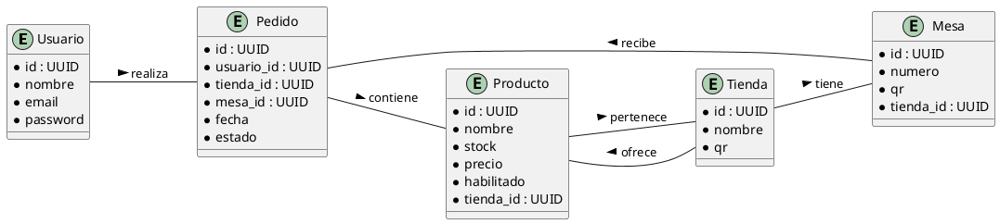

# Coffee Backend - Documentación y Planificación

## Requerimientos / Funcionalidades

1. **Sistema de login cifrado y validado por ciberseguridad**
2. **Sistema de referenciación tienda/pedido/usuario**
    - La tienda tendrá un ID único y QR asociado. Cada mesa también tendrá un QR vinculado a la tienda para identificar desde qué mesa se solicita el pedido.
    - Generar QRs para descargar.
3. **Frontend Customer app web** (solo tareas backend)
    - Endpoints para cargar productos, gestionar stock, ventas, puntuaciones y comentarios.
    - Sistema de mensajes usuario/tienda para consultas sobre stock.
4. **App para usuario móvil** (solo tareas backend)
5. **Funciones User**
    - Personalización total del pedido (cantidades, proporciones, nombre, hora de entrega, etc).
    - Gestión de descuentos por categoría o nombre de producto.
    - Identificación de tienda y mesa mediante QR.
    - Stock en tiempo real y endpoints para actualización.
6. **Carga de archivos a la nube** (videos, imágenes).
7. **Sistema de puntuación de productos.**
8. **Sección de comentarios para productos de la tienda.**
9. **Sistema de pago integrado a la app.**

---

## Propuesta de tareas backend (orden secuencial)

1. **Autenticación y Seguridad**
    - Login cifrado (bcrypt/argon2), JWT, middleware de autenticación.
    - Validaciones de ciberseguridad (rate limiting, helmet, CORS).
2. **Modelado de Base de Datos**
    - Modelos: Usuario, Tienda, Mesa, Producto, Pedido, Comentario, Puntuación, Descuento, Mensaje, Archivo.
    - Migraciones iniciales.
3. **Sistema de Referenciación y QRs**
    - Generación de IDs únicos y QRs para tienda/mesa.
    - Endpoint para descargar QRs.
4. **Gestión de Productos y Stock**
    - CRUD de productos, gestión de stock en tiempo real, deshabilitar productos.
5. **Pedidos Personalizados**
    - Endpoint para crear pedidos personalizados y relacionarlos con usuario, tienda y mesa.
6. **Sistema de Mensajes**
    - Endpoint para mensajes usuario/tienda sobre stock.
7. **Comentarios y Puntuaciones**
    - Endpoints para comentarios y puntuaciones por producto, cálculo de promedios.
8. **Descuentos y Promociones**
    - CRUD de descuentos, endpoint para obtener productos con descuentos activos.
9. **Gestión de Archivos**
    - Endpoint para subir archivos a la nube y relacionarlos con productos o tiendas.
10. **Integración de Pagos**
    - Endpoint para iniciar y confirmar pagos.
11. **Documentación y Testing**
    - Documentar endpoints (Swagger/OpenAPI), tests unitarios y de integración.

---

## Diagrama de entidades y relaciones (vista simple y horizontal)

Esta versión muestra solo las entidades principales y sus relaciones clave, en formato horizontal para mayor claridad visual.

---

## Explicación de la conexión de tablas (flujo secuencial)

1. **Usuario**: Es el punto de inicio. Un usuario se registra e inicia sesión en la plataforma.
2. **Tienda**: El usuario puede estar asociado a una tienda (por ejemplo, como dueño o empleado) o simplemente interactuar con una tienda como cliente.
3. **Mesa**: Cada tienda tiene varias mesas, cada una identificada por un QR único. El usuario escanea el QR de la mesa para iniciar un pedido.
4. **Producto**: Las tiendas ofrecen productos. El usuario puede ver el listado de productos disponibles y sus detalles (stock, precio, etc).
5. **Pedido**: El usuario, desde una mesa específica, crea un pedido seleccionando productos y personalizándolos según sus preferencias.
6. **Relación Pedido-Producto**: Un pedido puede contener varios productos, cada uno con su cantidad y personalización.
7. **Comentarios y Puntuaciones**: Tras recibir el pedido, el usuario puede dejar comentarios y puntuaciones sobre los productos.

Este flujo asegura que cada acción del usuario (desde el escaneo del QR hasta la valoración del producto) queda correctamente referenciada en la base de datos, permitiendo trazabilidad y gestión eficiente.

---

## Opciones de nombres para endpoints (API REST)

### Usuarios
- POST   /api/users/register
- POST   /api/users/login
- GET    /api/users/profile

### Tiendas
- GET    /api/shops
- POST   /api/shops
- GET    /api/shops/:shopId
- PUT    /api/shops/:shopId
- DELETE /api/shops/:shopId

### Mesas
- GET    /api/shops/:shopId/tables
- POST   /api/shops/:shopId/tables
- GET    /api/shops/:shopId/tables/:tableId

### Productos
- GET    /api/shops/:shopId/products
- POST   /api/shops/:shopId/products
- GET    /api/shops/:shopId/products/:productId
- PUT    /api/shops/:shopId/products/:productId
- DELETE /api/shops/:shopId/products/:productId

### Pedidos
- POST   /api/orders
- GET    /api/orders/:orderId
- GET    /api/users/:userId/orders
- GET    /api/shops/:shopId/orders

### Comentarios y Puntuaciones
- POST   /api/products/:productId/comments
- GET    /api/products/:productId/comments
- POST   /api/products/:productId/ratings
- GET    /api/products/:productId/ratings

### QRs
- GET    /api/shops/:shopId/qr
- GET    /api/shops/:shopId/tables/:tableId/qr

### Archivos
- POST   /api/files/upload
- GET    /api/files/:fileId

### Descuentos
- GET    /api/shops/:shopId/discounts
- POST   /api/shops/:shopId/discounts

### Pagos
- POST   /api/payments/initiate
- POST   /api/payments/confirm

### Cancelación y devolución
- POST /api/orders/:orderId/cancel
- POST /api/orders/:orderId/refund

### Cambio de mesa
- PATCH /api/orders/:orderId/change-table

Estas rutas siguen las mejores prácticas REST y son fácilmente escalables.

---

## Consideraciones adicionales

### Cancelación de pedido
- El usuario podrá cancelar un pedido si aún no ha sido procesado/preparado.
- Al cancelar, el estado del pedido se actualizará a "cancelado" y se registrará la fecha/hora de cancelación.

### Devolución de dinero
- Si el pedido fue pagado y luego cancelado, se debe iniciar el proceso de devolución automática del dinero (refund) a través de la pasarela de pagos.
- Se debe guardar el estado y resultado de la devolución en la base de datos.

### Cambio de mesa
- El usuario podrá solicitar el cambio de mesa mientras el pedido no haya sido entregado.
- Se actualizará el campo `mesa_id` del pedido y se dejará registro del cambio (historial de movimientos opcional).

---

¿Quieres que adapte el diagrama a otra vista o que avance con la siguiente tarea?
